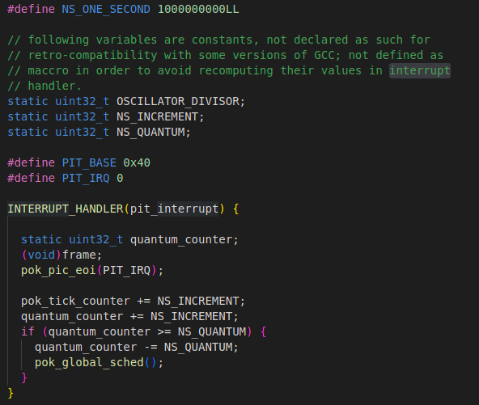

# 《实时系统与调度》设计与实现报告

小组成员： 邹立凯 吴泽一 蓝煜斌

项目仓库：https://github.com/lintonfirst/pok-sched.git

### GET STARTED

首先，从pok-kernel仓库中clone最新的main分支到本地，并以此为基础进行修改。

参照官网的get started配置环境，能够运行examples中的semaphore程序。

接着，参考官网的overview文档，熟悉pok的系统架构。由于不了解qemu调试的手法，只能通过阅读源代码和修改example程序看运行结果来推测其中的逻辑。

**时间片**



通过pit.c这个文件了解了时间片和调度的关系。pok里的1s定义为100000000，thread里配置deadline时数值要与这里的1s处于相近的数量级上。每次中断触发时，时间计数器会增加相当于NS_INCREMENT的数值，如果时间计数器的值达到了一个时间片（NS_QUANTUM），那么就会触发一次调度。每次调度时，线程对应的remaining_time_capacity就会减少1；在一个周期内，如果线程的remaining_time_capacity耗尽了，意味着该任务执行完毕，在同一个周期内不会再被调度。在实验中发现，线程的period和time_capacity属性是强相关的，不能随意修改，因此在我们的实验中，period和time_capacity的配置和semaphore示例程序中的配置处于相同的数量级。

**调度算法的配置**

参照semaphore示例，通过kernel文件中deployment.h中的POK_CONFIG_PARTITIONS_SCHEDULER宏定义项来决定内核使用哪一种调度策略。

在partition.c文件的pok_partition_setup_scheduler函数中，会根据POK_CONFIG_PARTITIONS_SCHEDULER来为该分区配置对应的调度函数。

因此，想要增加自己的调度策略，只需要按照以下函数原型完成自己的函数实现即可。

```cpp
uint32_t my_sched_func(const uint32_t index_low, const uint32_t index_high, const uint32_t prev_thread,const uint32_t current_thread);
```

由于不同的调度策略依赖不同的属性值，如优先级调度策略依赖priority，edf依赖deadline，wrr依赖权重，所以需要相应地增加pok_thread_t和pok_thread_attr_t的字段、改写thread初始化函数，才能支持这些新增的调度策略。

**为什么pok不支持动态创建线程**

在thread.c的pok_partition_thread_create函数中，有下列语句。

```cpp
if ((pok_partitions[partition_id].mode != POK_PARTITION_MODE_INIT_COLD) &&
    (pok_partitions[partition_id].mode != POK_PARTITION_MODE_INIT_WARM)) {
	return POK_ERRNO_MODE;
}
```

因此，当运行时尝试通过pok_thread_create函数创建线程时，由于当前不处于INIT阶段，会直接返回POK_ERRNO_MODE，导致创建失败。

**调试**

由于不会调试qemu，所以全靠printf打印进行调试。

printf主要打在用户态程序、thread.c和sched.c中，足够帮助我们找到bug的原因。

### 四种调度算法实现

### 动态增加线程实现

### MLFQ算法与实现
### 相互依赖的多任务并行应用场景

### 多任务并行下考虑依赖关系的调度算法设计与实现